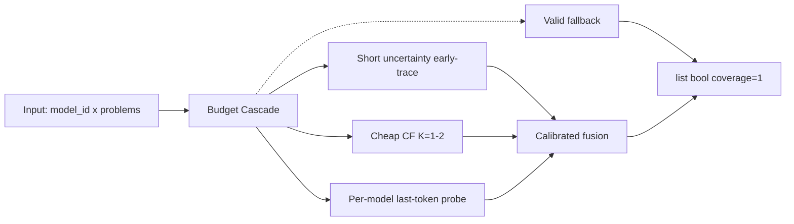

```mermaid
flowchart LR
  A[Input: model_id x problems] --> B[Budget Cascade]
  B --> C[Short uncertainty early-trace]
  B --> D[Cheap CF K=1-2]
  B --> E[Per-model last-token probe]
  C --> F[Calibrated fusion]
  D --> F
  E --> F
  B -.-> G[Valid fallback]
  G --> H[list bool coverage=1]
  F --> H
```
